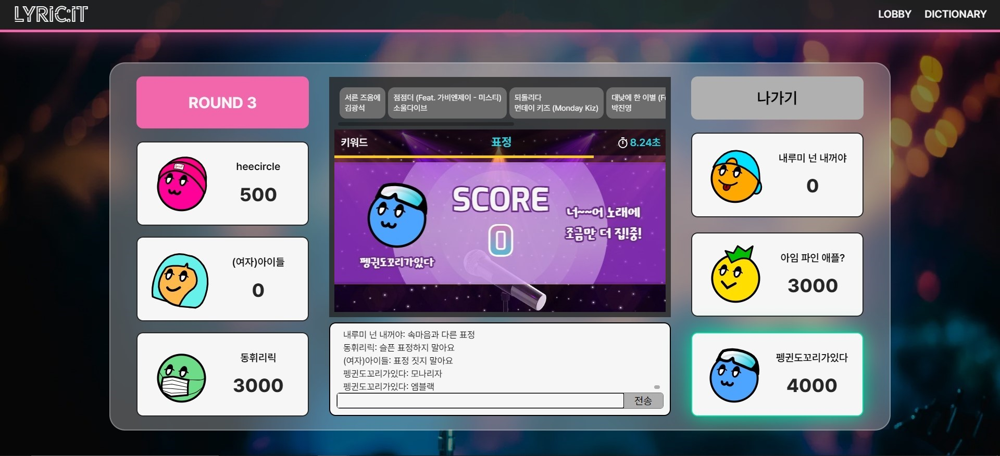
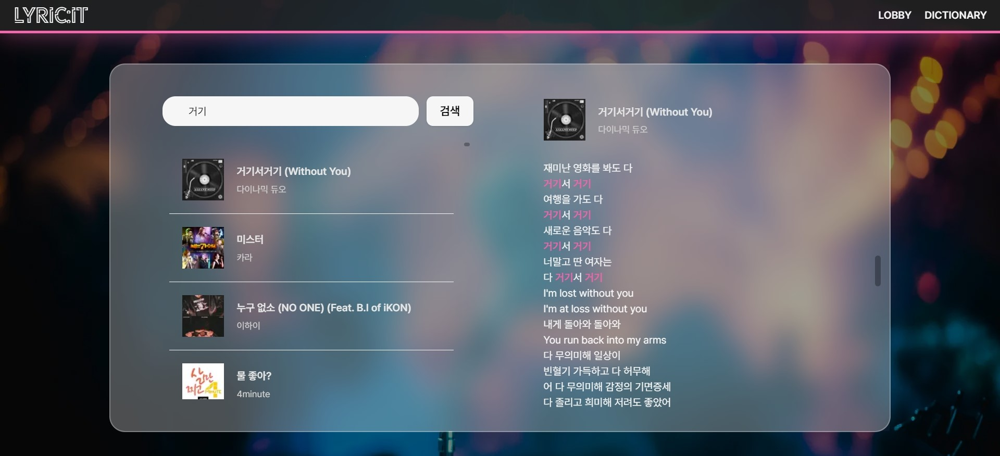

  

---

## 📚 TOC

- [BACKEND & DATA TEAMS](#backend-data-teams)
- [ROLE](#role)
- [DEPLOY URL](#deploy-url)
- [SPECIFICATION](#specification)
- [INTRODUCTION](#introduction)
- [SKILLS](#skills)
- [SYSTEM ARCHITECTURE](#system-architecture)
- [SERVICE LAYOUT](#service-layout)
- [FUNCTION](#function)

 

---

## 🤝 Backend & Data Team

|  |  |  |  |
|:--------------------------------------------------------------------------------------------------------:|:------------------------------------------------------------------------------------------------------:|:----------------------------------------------------------------------------------------------------:|:----------------------------------------------------------------------------------------------------------:|
|                                  [김건우](https://github.com/takealook97)                                   |                                  [윤동휘](https://github.com/YUNDONGHWI)                                  |                                 [용희원](https://github.com/heecircle)                                  |                                   [박세정](https://github.com/sejeong-park)                                   |

---

## 🙋‍♂️ Role

### 김건우

- 백엔드 리더
- 서버 CI/CD 구축 및 인프라 총괄
- 웹소켓 통신 구축
- 회원 기능 API 구축
- 채팅 기능
- 방 생성 및 게임 참여 API 구축
- 게임 플로우 전체 리팩토링
- 게임 내 타이머 스케줄링

### 윤동휘

- 게임 준비 및 시작 기능
- 게임 플로우 구축
- 게임 내 가사 검색 기능
- 발표 전체 담당

### 용희원

- 팀장
- 음악 차트 데이터 크롤링
- Docker를 활용한 Spark 환경 구축
- Spark를 통한 분산 처리 진행
- 한국어 토크나이징을 통한 제시어 추출
- Elastic Search 동의어 사전 작성
- Dictionary 컴포넌트 작성

### 박세정

- Dictionary 사전 API 구축
- 음악 차트 데이터 크롤링
- Docker을 활용한 Elastic Search 클러스터 구축
- ElasticSearch custom analyzer 를 제작하여 검색 성능 개선

---

## 🕊️ Deploy URL

- ✅ front-server : https://dev.lyricit.site
- ✅ back-server : https://api-dev.lyricit.site
- ✅ back-swagger : https://api-dev.lyricit.site/swagger-ui/index.html

 

## 📝 Specification

- notion : https://takealook97.notion.site/lyricit-b33c49f68e194e3692008dc9b8839c68

 

---

## 📢 Introduction

### main-service

- **LYRIC:IT (리릭잇)**
- 노래 가사 기반 게임 서비스
- 채팅 기능을 통해 웹 기반의 인터렉티브한 소통형 게임을 즐길 수 있다.
- 가사 데이터를 전처리하여 단어 별 빈도를 기준으로 랜덤 키워드를 라운드마다 제시한다.
- 키워드가 포함된 가사를 입력한뒤, 해당 가사를 포함하는 곡의 제목과 가수를 입력한다.
- 정답을 맞추면 라운드마다 선착순 별로 차등된 점수를 획득한다.

### sub-service

- 가사 키워드 데이터 사전 검색 기능

 

---

## 🛠️ Skills

### language

- Java 17

### framework

- SpringBoot 3.2.1
- Spring Data JPA

### sub

- WebSocket (STOMP)
- Quartz Scheduler
- Selenium (Crawler)

### data

- Spark 3.5.1
- Kibana 8.12.2

### database

- MySQL 8.0.35
- Redis 7.2
- Elastic Search 8.12.2

### ci / cd

- AWS EC2
- Jenkins
- Docker, Docker Hub, Portainer
- Nginx Proxy Manager

 

---

## 🌐 System Architecture

 

---

## 🏠 Service Layout

|  |  |
|:------------------------------------------------------------:|:----------------------------------------------------------:|
|                          Main Page                           |                           Lobby                            |

|  |  |
|:---------------------------------------------------------:|:---------------------------------------------------------:|
|                           Room                            |                           Game                            |

|  |  |
|:----------------------------------------------------------:|:---------------------------------------------------------------:|
|                       Correct Answer                       |                          Wrong Answer                           |

|  |  |
|:----------------------------------------------------------:|:---------------------------------------------------------------:|
|                           Result                           |                           Dictionary                            |

 

---

## ⚙️ Function

### 🎯 회원

💡 WebSocket session 기반 간편 가입 & 로그인

- [x] 회원 가입 및 로그인(웹소켓 연결)
- [x] 로그아웃 (웹소켓 세션 종료)

### 🎯 로비

💡 전체 채팅, 방 생성, 입장, 상태 업데이트

- [x] 로비 채팅 기능
- [x] 로그인 회원 조회
- [x] 방 생성
- [x] 방 입장
- [x] 방 목록 조회
- [x] 방 업데이트 시 STOMP 를 통한 실시간 상태 연동 (인원, 게임 실행 상태 등)

### 🎯 사전

💡 Elastic Search 를 활용한 노래 가사 사전 검색

- [x] 가사 키워드 검색

### 🎯 게임 방

💡 Redis 기반 게임 방 관리

- [x] 실시간 채팅
- [x] 게임 준비 상태 변경
- [x] 방장 변경 및 방 자동 삭제
- [x] 게임 시작

### 🎯 게임

💡 웹소켓 통신을 통한 실시간 채팅 기반 소통형 게임

- [x] 실시간 채팅을 통한 정답 제출
- [x] 단어 빈도 기반 랜덤 키워드 제시
- [x] 라운드 별 초 단위 스케줄링
- [x] 선착 순 점수 부여
- [x] 점수 합산을 통한 게임 결과 확인
